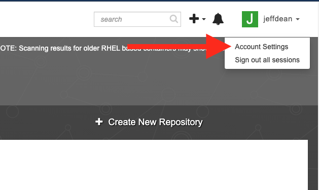
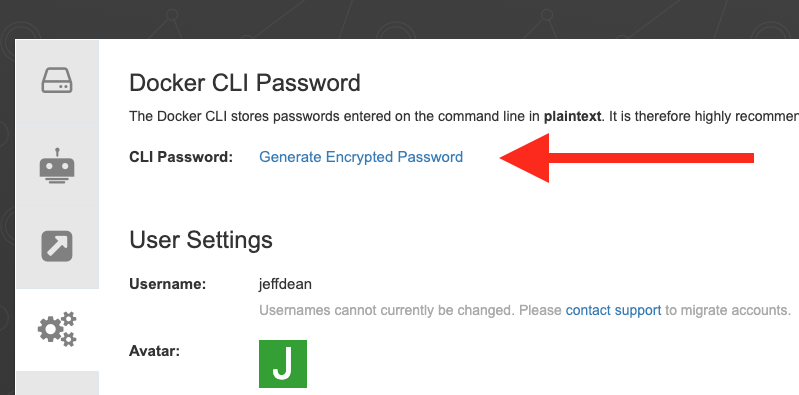
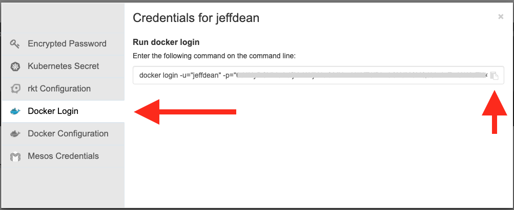
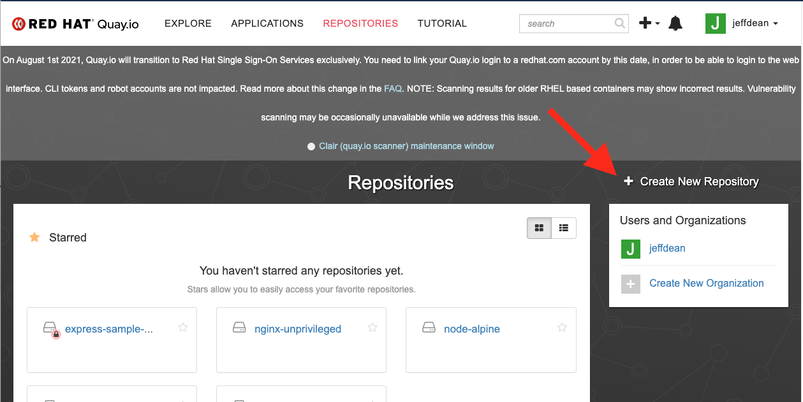
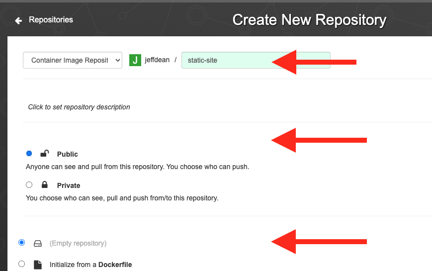
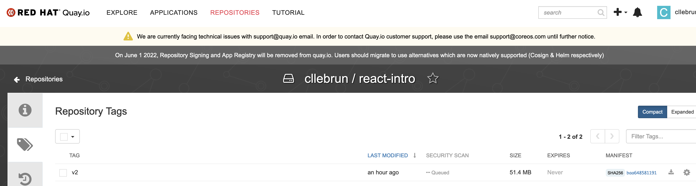

# Podman Assignment


## Prerequisites

- To be able to access the github.ibm.com repository from your laptop, you need to have a SSH key that is using RSA and has no passphrase (for the following labs).
If your key was added to the ssh agent, you can use your SSH key and connect to your account:
```
ssh -T git@github.ibm.com
```

> If not done yet, please follow the Bootcamp prereq:
Windows: https://github.ibm.com/emea-ce-cloud-native-boot-camp/emea-bootcamp-prereq/blob/main/windows.md#git
Mac: https://github.ibm.com/emea-ce-cloud-native-boot-camp/emea-bootcamp-prereq/blob/main/mac.md#git

- We will use **Quay** in this assigment. You can sign up/sign in with Github or Redhat, or create your account:

    1. Visit https://quay.io/signin/
    1. Click "Create Account"

## Standards to Achieve


By completing this assignment, you demonstrate the following Standards:

- Create and run a React application locally
- Contenerize the application: Build an image using a Dockerfile
- Run the container locally
- Tag the image
- Push the image to a registry

## Instructions
For this assignment you will containerize a React application and serve it using `nginx`.

> **NOTE** For Windows users, run all commands from within Ubuntu (WSL)

#### Login to Quay from your machine

Go to your account settings:



Click "Create Encrypted Password":



Copy the docker login command but replace **docker** by **podman**:



Run that command from your Terminal.

> NOTE: Windows users, do this from the Ubuntu Terminal

#### Create a Repository

From the Quay.io dashboard, click "Create New Repository"



Name it `react-intro` and make it public:



## Create a React app

### Set up a new React app

Create a workspace in your home folder (`~`) of your local machine (or any folder **other** than the one where you have cloned the `assignments` repository):

```
mkdir ~/workspace
cd ~/workspace
```

Now, create a new React app:

```
npx create-react-app react-intro
cd react-intro
```

_Notice:_ The app is **not** created under your `assignments` folder.

If you do not have [`npx`](https://www.npmjs.com/package/npx) installed, you can install it with `npm install -g npx`.

### Start the React app

```
npm start
```

This should open `http://localhost:3000` and you should see a React welcome page.


Press `q` or `CTRL+C` to exit.

### Commit your changes

Within the application folder `react-intro` initialize a new git repository and commit your changes:

```
git init
git add .
git commit -m "create react app"
```

### Create a Remote GitHub Repository and Push

Go to [GitHub IBM](https://github.ibm.com), make sure you have authenticated, then create an **empty repository** with a unique name in the emea-ce-cloud-native-boot-camp-cohort-X organization. A good convention is to begin with your name, then assignment, for example: `john-doe-react`.

Copy the commands for pushing an existing repository and execute them where you created the React application in the previous steps.

```
git remote add origin git@github.ibm.com:emea-ce-cloud-native-boot-camp-cohort-X/<your-repository-name>.git
git branch -M main
git push -u origin main
```

## Contenerize the React App

Since React is a client-side JavaScript framework, we need something to act as a webserver. For our purposes we select [Nginx](https://www.nginx.com/).

- Create the following files:

`nginx.conf` (same as above):

```
server {
    listen       8080;
    server_name  localhost;
    location / {
        root   /usr/share/nginx/html;
        index  index.html index.htm;
        try_files $uri $uri/ /index.html =404;
    }
    error_page   500 502 503 504  /50x.html;
    location = /50x.html {
        root   /usr/share/nginx/html;
    }
}
```

`Dockerfile`

```
FROM quay.io/upslopeio/node-alpine as build
WORKDIR /app
COPY . .
RUN npm install
RUN npm run build

FROM quay.io/upslopeio/nginx-unprivileged
COPY --from=build /app/build /usr/share/nginx/html
COPY --from=build /app/nginx.conf /etc/nginx/conf.d/default.conf
```

Then from the command line, to build you would execute the following commands:

```
# no need to run npm build
podman build -t quay.io/<user-name>/react-intro .
```

>If you are using a M1 mac, you may have the following error:
```
STEP 4/5: RUN npm install
exec container process `/bin/sh`: Exec format error
Error: error building at STEP "RUN npm install": error while running runtime: exit status 1
```
You need to change the first line in the Docker file to
```
FROM node as build  
```
and the build command is needed to change like this:
```
 podman build --platform=linux/arm64/v8 -t quay.io/<user_name>/react-intro .
 ```

You can see that image now exists on your machine with the following command:

```
podman image ls
```
```
podman run -it -p 8080:8080 --rm quay.io/<user-name>/react-intro
```

Then open `http://localhost:8080` in your browser to see it work.

From a different Terminal window you can see that the process is running with the following command:

```
podman ps
```

When you have completed this, make a commit/push to your React app repository on GitHub.

### Push the image to quay.io

First, add a tag to the image (replace USERNAME with your quay.io username):

```
podman tag quay.io/<user-name>/react-intro quay.io/<user-name>/react-intro:v1
```

You can see that image now has tags on your machine:

```
podman image ls
```

Then push the image to quay.io (replace USERNAME with your quay.io username):

```
podman push quay.io/<user-name>/react-intro:v1
```

Check your Quay account, your image appears now in the repo react-intro you have created:


>### Multistage build
The above `Dockerfile` is a [multistage build](https://docs.docker.com/develop/develop-images/multistage-build/) file. In short, this means there is more than one `FROM` statement in the `Dockerfile`
>- **Pros**: You don't need to build the React application locally before building the docker image.
>- **Cons**: The Dockerfile is more complex, and may re-download npm packages and re-run the build which might not be necessary (depending on your build system).

## Submit the Assignment

0. IF YOU DID NOT COMPLETE THE GIT ASSIGNMENT: First, begin by cloning the provided session assignment repo (check the session's Slack channel for this - it is pinned to the channel). For example if you participate to the session 1, the right session assignment repo to clone is "emea-bootcamp-assignments"  in a repository called `emea-ce-cloud-native-boot-camp-cohort-1`
1. `cd` to the `assignments` repository (i.e. where you cloned the `assignments` repository).
2. Follow [the steps](../git/git-workflow-step-by-step.md) outlined in the git workflow to create a new branch.
3. In your `<your-name>` repository, create a new repository `podman-assignment`
3. Create a new file named `<your-name>/podman-assignment/README.md`.
4. Add your name to the `README.md` file and save it.
5. Create a new file named `<your-name>/podman-assignment/repository-url.txt`.
6. Copy the URL to your React repository into the text file and save it.
7. Make a commit that includes **_only_** the changes for this assignment. (_hint:_ What do you need to do first? Why might your changes be rejected?)
8. Push your changes to the remote branch.
9. Create a new Pull Request on GitHub.com

**_IMPORTANT:_** Do not merge Pull Requests yourself.

### Common Pull Request Issues

| Issue                                                                           | Solution                                                                                                                          |
| ------------------------------------------------------------------------------- | --------------------------------------------------------------------------------------------------------------------------------- |
| Contains files outside of `<your-name>/podman-assignment/` folder               | `mv` the files to the correct location under your folder.                                                                         |
|                                                                                 | You have changes that are not related to this assignment.                                                                         |
|                                                                                 | Merge in changes from main and push the branch again. The changes you see in the PR at this point do not exist in main.           |
|                                                                                 | The solution to remove a change depends on the change. Is it a deleted file? Restore the file. Is it a new file? Delete the file. |
| Contains any file other than `<your-name>/podman-assignment/repository-url.txt` | Delete these files and also add them to `<your-name>/git-assignment/.gitignore`                                                   |

---

🛑 Everything in the next section is **optional**, you may skip this if you are not interested.

---

### Background

Public DockerHub images are [severely rate-limited](https://www.docker.com/increase-rate-limits).

Quay.io does not have rate limits on public repositories.

On a client site, you will have an internal Docker registry. In fact, even in class there's an [internal docker registry](https://docs.openshift.com/container-platform/3.3/install_config/registry/accessing_registry.html) on OpenShift Container Platform which you can use.

You can see access information about the OpenShift image repository by running `igc credentials`.

For this tutorial we're referencing images pushed to a personal Quay.io account.

❌️❌ WARNING: these images are not maintained up-to-date and may contain un-patched security vulnerabilities. DO NOT USE on a production application or client site. ❌❌

If you want a more recent image, do the following:

```
export QUAY_USER=<your quay.io username>

podman pull node:alpine
podman tag node:alpine quay.io/$QUAY_USER/node-alpine
podman push quay.io/$QUAY_USER/node-alpine

podman pull nginxinc/nginx-unprivileged
podman tag nginxinc/nginx-unprivileged quay.io/$QUAY_USER/nginx-unprivileged
podman push quay.io/$QUAY_USER/nginx-unprivileged
```

### Build then Build 😉

React applications (as well as other single-page applications) compile down to static files (HTML, CSS, fonts, etc...).

In order to build these applications, you need to add two files:

1. Dockerfile
1. nginx.conf

`nginx.conf`:

```
server {
    listen       8080;
    server_name  localhost;
    location / {
        root   /usr/share/nginx/html;
        index  index.html index.htm;
        try_files $uri $uri/ /index.html =404;
    }
    error_page   500 502 503 504  /50x.html;
    location = /50x.html {
        root   /usr/share/nginx/html;
    }
}
```

`Dockerfile`

```
FROM quay.io/upslopeio/nginx-unprivileged
COPY build /usr/share/nginx/html
COPY nginx.conf /etc/nginx/conf.d/default.conf
```

Then from the command line, to build you would execute the following commands:

```
npm run build
podman build -t dockerized-react-app .
podman run -it -p 8080:8080 --rm dockerized-react-app
```

Then open `http://localhost:8080` in your browser to see it work.

**Pros** Your Dockerfile is super simple.

**Cons** You need to build the application before building the Dockerfile.
